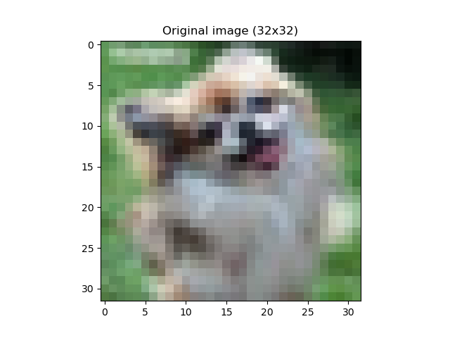
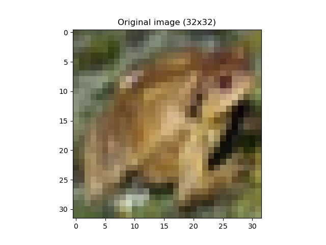
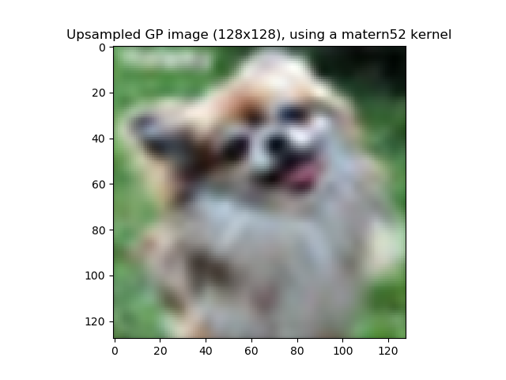
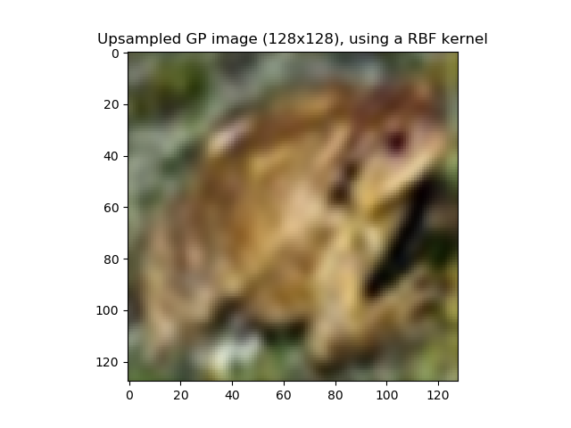

# Gaussian Process (Naive) SuperResolution

This Repo contains code for naively upsampling images from 32x32 to 128x128
using a Gaussian Process defined on the 2D-image grid.

The correlations are computed using only image distance, which makes the method similar
to e.g. bicubic interpolation.

TODO: For iterated processing the kernels can be precomputed which would save a lot of time.

TODO: Perhaps local image structure could be utilized to change how the correlations are computed.

## Usage

Run:

```shell
$ python main.py 
```

For a demo on some CIFAR10 images

Or Run:

```shell
$ python main.py your_image.png
```

## Demo

### Orignal Images




### Matern 5/2 Kernel




### RBF Kernel



